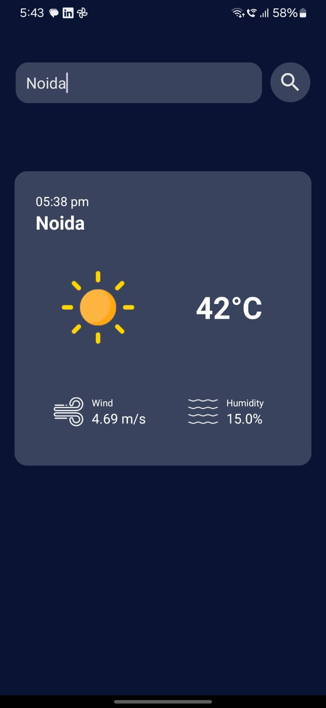

# 🌤️ Weather App

A basic weather app that fetches real-time weather data based on the city name entered by the user.

## 📱 Preview

  

## 📱 APK Download

To try out the Weather app without building it manually:

1. **[Click here to download the APK](https://github.com/Blank102/WeatherAPP/blob/master/APK/Weather.apk)**  

2. On your Android device:
   - Go to `Settings > Security > Install unknown apps`
   - Allow installation from your browser or file manager

3. Open the downloaded file and tap **Install**

4. Launch the app from your app drawer

## 🔍 Features
- Search weather by city
- Displays temp, humidity, and condition
- Clean, mobile-friendly UI

## ⚙️ Built With
- Java
- OpenWeatherMap API

